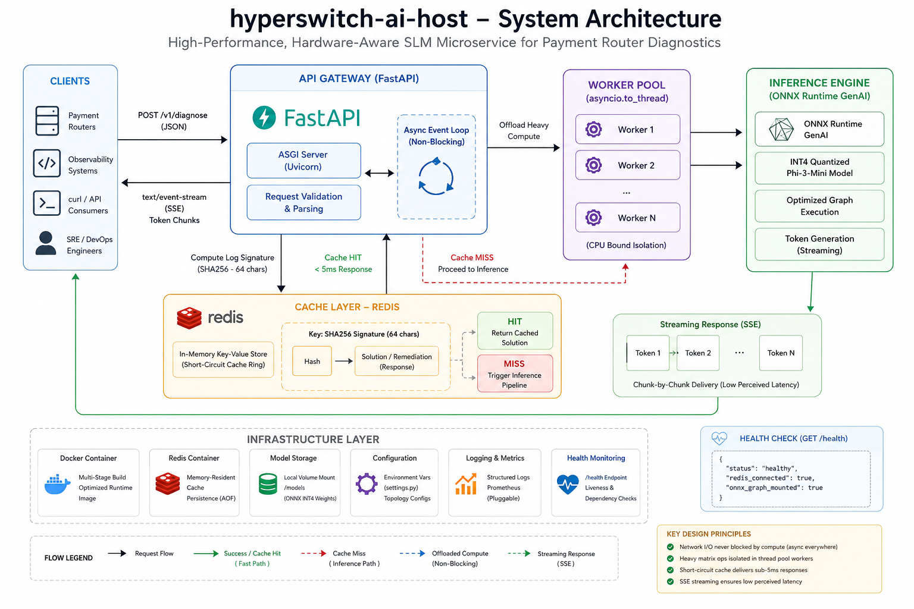

# hyperswitch-ai-host

`hyperswitch-ai-host` is a high-performance, hardware-aware Small Language Model (SLM) microservice engineered to serve as an automated diagnostic and triage tier for high-throughput payment routers. 

By bypassing heavy, expensive cloud-hosted models, this engine runs entirely on local consumer-grade CPUs—intercepting raw telemetry errors, database serialization panics, and thread exceptions to deliver actionable remediation strategies instantly.

---

## System Architecture

The microservice decouples network ingestion from raw tensor mathematics to ensure the core event loop never blocks:

* **Asynchronous Gateway:** Built on **FastAPI**, leveraging `asyncio.to_thread` workers to isolate heavy compute matrix routines from the main ASGI network thread.
* **Hardware-Accelerated Inference:** Runs a highly compressed **Microsoft Phi-3-Mini (INT4 Quantized)** model natively via **ONNX Runtime GenAI**, completely eliminating PyTorch/Hugging Face library overhead.
* **Low-Latency Streaming:** Utilizes Server-Sent Events (SSE) via FastAPI's `StreamingResponse` to deliver tokens chunk-by-chunk, eliminating perceived processing delays.
* **Short-Circuit Cache Ring:** Processes incoming unformatted logs into deterministic 64-character SHA256 cryptographic signatures. Duplicate issues query a local, memory-resident **Redis** cluster to return solutions instantaneously.

---

## Architecture Diagram



## Performance Matrix

| Request Profile | Execution Pathway | CPU Overhead | Core System Latency |
| :--- | :--- | :--- | :--- |
| **Cache Miss** (New Error Pattern) | Gateway ➔ Thread Pool ➔ ONNX Engine ➔ Token Stream | ~100% (Isolated Workers) | ~15–20s (Perceived: <200ms via chunk streaming) |
| **Cache Hit** (Identical Log Signature) | Gateway ➔ Redis Crypto-Signature Match ➔ Return | 0% | **< 5 Milliseconds** |

---

## Directory Structure

```text
hyperswitch-ai-host/
├── app/
│   ├── __init__.py
│   ├── cache.py       # Cryptographic Redis token lookup ring
│   ├── inference.py   # ONNX Runtime GenAI matrix math stream
│   └── main.py        # Asynchronous FastAPI web endpoints
├── config/
│   └── settings.py    # Environment variable topologies
├── docker-compose.yml # Multi-container infrastructure orchestration
├── Dockerfile         # Multi-stage production runtime container
└── requirements.txt   # Locked dependency configurations
``` 

---

## API Specification & Endpoints

### 1. Diagnostic Ingestion Pipeline

* **Endpoint:** `POST /v1/diagnose`
* **Content-Type:** `application/json`

#### Payload Structure

```json
{
  "error_log": "String containing the raw system or gateway exception",
  "context": "Optional string providing ambient cluster variables"
}
```

* **Response Type:** `text/event-stream`
  Tokens are streamed chunk-by-chunk. Responses are prefixed with `[CACHE HIT]` if served from Redis.

---

### 2. Infrastructure Health Check

* **Endpoint:** `GET /health`
* **Response Type:** `application/json`

#### Response Structure

```json
{
  "status": "healthy",
  "redis_connected": true,
  "onnx_graph_mounted": true
}
```

---

## Local Quick Start

### Prerequisites

* Python 3.11+
* Docker & Docker Compose
* Downloaded INT4 ONNX weights for Phi-3-Mini placed inside the `models/` directory

---

### 1. Clone & Initialize the Stack

```bash
git clone https://github.com/YOUR_USERNAME/hyperswitch-ai-host.git
cd hyperswitch-ai-host
```

---

### 2. Launch via Docker Compose (Recommended)

```bash
docker compose up --build
```

---

### 3. Verify the Port Gateways

* API Ingestion Endpoint:
  `http://localhost:8000`

* Interactive OpenAPI Docs:
  `http://localhost:8000/docs`

---

## Operational Testing

Test token streaming by sending a sample error log:

```bash
curl -N -X POST "http://localhost:8000/v1/diagnose" \
     -H "Content-Type: application/json" \
     -d '{"error_log": "Unable to deserialize revolv3 as Connector: Matching variant not found"}'
```

Re-run the same command to verify sub-5ms Redis cache response.

---

## Security & Production Considerations

### Local Weight Footprint

Ensure that the ~2.2GB model weights (`models/`) are added to `.gitignore` to avoid repository size issues.

---

### Memory Isolation

The system uses `asyncio.to_thread` to offload ONNX computation from the main event loop.

For constrained environments:

* Configure `intra_op_num_threads` in `config/settings.py`
* Match it to the number of **physical CPU cores**
* Prevent excessive thread contention and scheduling overhead

---
